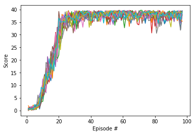
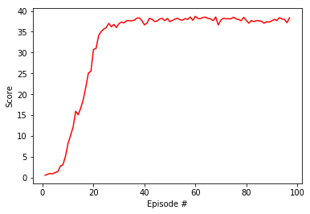

# DRLND Project 2 Report (Continuous Control) Reacher with DDPG

## Introduction

For this project, I decided to work on solving the version of the Reacher environment with 20 agents. I chose to implement the DDPG algorithm, based on the following facts.

* DDPG is very effective when it comes to the continuous action space.
* DDPG is an off-policy algorithm, which means Experience Replay buffer could be used, which allows the reuse of experience tuples.
* Actor-Critic algorithm so it brings in advantages of DQN and Policy-gradients together. 

## Learning Algorithm

[DDPG](https://arxiv.org/pdf/1509.02971.pdf) was introduced as an actor-critic method that performs well in environments with a continuous action space, which is a known limitation of the popular DQN algorithm. It improves on the deterministic policy gradient (DPG) algorithm by using a neural network to take advantage of generalization and function approximation.

The algorithm consists of two different types of neural networks: an actor and a critic. The actor-network is used as an approximate for the optimal deterministic policy. As a result, only one action is returned for each state, which is considered to be the best action at that state. The critic, on the other hand, learns how to evaluate the optimal action-value function by using actions from the actor. The main idea of the algorithm is that the actor calculates a new target value that is used to train the action-value function in the critic.

It's important to clarify that DDPG actually makes use of 4 different neural networks in its implementation: a local actor and a target actor, as well as a local critic and a target critic. Additionally, there are two other important features of the algorithm. The first is that it also uses a replay buffer, just like DQN. The second is that it uses soft updates as the mechanism to update the weights of the target networks. This mechanism replaces the fixed update every C time steps which was used in the original version of DQN and often leads to better convergence. However, soft updates are not exclusive to DDPG and can also be used in other algorithms such as DQN.


## Model Architecture

```
Actor-Network
-----------------------------------------------------------------------------
        Layer (type)               Output Shape         Param #     Activation
=============================================================================
            Linear-1                  [33, 512]          17,408     Relu
            Linear-2                  [512, 512]         262,656    Relu
            Linear-3                  [512, 512]         262,656    Relu
            Linear-4                    [512, 4]           2,052    Tanh
============================================================================
Total params: 544,772
Trainable params: 544,772
Non-trainable params: 0
----------------------------------------------------------------------------

Critic Network
-----------------------------------------------------------------------------
        Layer (type)               Output Shape         Param #     Activation
=============================================================================
            Linear-1                  [33, 512]          17,408     Relu
            Linear-2                  [512 + 4, 512]     262,656    Relu
            Linear-3                  [512, 512]         262,656    Relu
            Linear-4                    [512, 1]           2,052    None
============================================================================
Total params: 544,772
Trainable params: 544,772
Non-trainable params: 0
----------------------------------------------------------------------------


actor model been used .. Actor(
  (fc1): Linear(in_features=33, out_features=512, bias=True)
  (fch2): Linear(in_features=512, out_features=512, bias=True)
  (fch3): Linear(in_features=512, out_features=512, bias=True)
  (fc2): Linear(in_features=512, out_features=4, bias=True)
)
critic model which is used .. Critic(
  (fcs1): Linear(in_features=33, out_features=512, bias=True)
  (fc2): Linear(in_features=516, out_features=512, bias=True)
  (fc3): Linear(in_features=512, out_features=512, bias=True)
  (fc4): Linear(in_features=512, out_features=1, bias=True)
)

```

As described above, the model architecture for this DDPG consists of two types of networks: an actor and a critic. Their structure in this implementation follows the networks described in the original paper very closely. Each consists of 4 fully-connected layers. The first three layers of each network use the `ReLU` activation function. 

The output layer for the actor uses a `Tanh` activation since the action in the Reacher environment consist of a tuple of 4 different numbers between -1 and 1. By using `Tanh`, 
the actor-network outputs a different continuous value between -1 and 1 for each index in the action tuple. This allows DDPG to succeed in environments with continuous action spaces. 

The critic network does not make use of an activation function in the output layer.
## hyperparameters
My implementation of the algorithm described above makes use of the following hyperparameters, which are also used in the original DDPG paper:

```
BUFFER_SIZE = int(1e6)  # replay buffer size
BATCH_SIZE = 128      # minibatch size

GAMMA = 0.99            # discount factor
TAU = 1e-3              # for soft update of target parameters

LR_ACTOR = 1e-4         # learning rate of the actor 
LR_CRITIC = 1e-3        # learning rate of the critic

WEIGHT_DECAY = 0.000   # L2 weight decay

UpdateCount = 2 # after these no of times the update to the neural net takes place 
UpdateNo = 5 # no of updates per time

```
## Exploration 

For exploration, the OU noise is used as it's suggested in the paper. 

Since the Reacher environment that's been used in this project contains about 20 agents and each has an action space of (4). The OU noise is programmed to provide different noise for each agent with a shape of (20, 4).
Which allows all the 20 agents to explore different types of actions at the same time.

This gives the boost to the ddpg agent training as the model is able to collect a variety of experience at the same time.


## Training and Results

#### plot scores of all agents:

#### average score of all 20 agents


As shown in the plot above and in the `Continuous_Control.ipynb` notebook, my agent is able to solve the environment just after 30 episodes as it was able to score high rewards continuously after it, at 100th episode the training was stopped as the desired scores were achieved.

## Future Work 
For future work, I would like to implement the same project with PPO and A3C to compare with the current performance. 

Especially with PPO as it promises more stable learning with Trust Region Policy Optimization. I am even more interested to combine TRPO with DDPG to check how that would affect the performance. Just like this paper <a href="https://openreview.net/pdf?id=B1MB5oRqtQ"> ON-POLICY TRUST REGION POLICY OPTIMISATION
WITH REPLAY BUFFERS </a>
